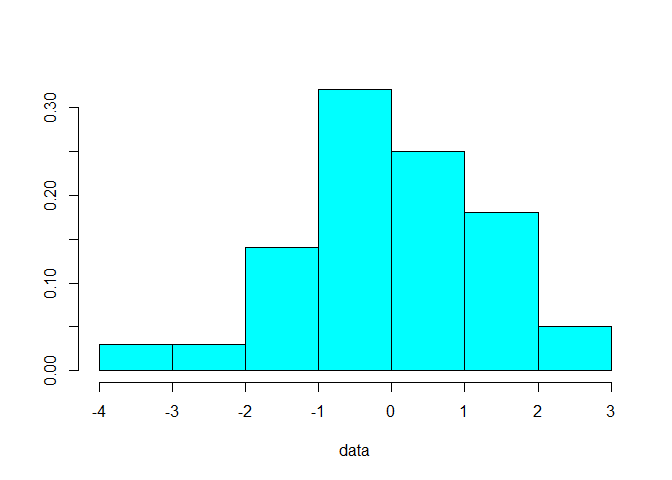
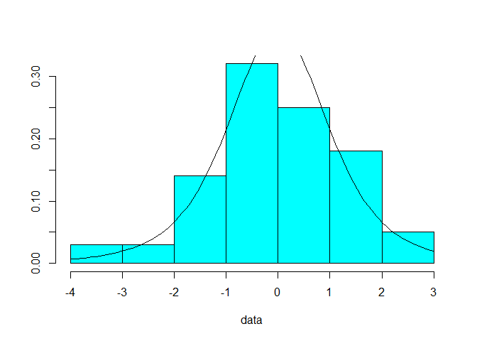
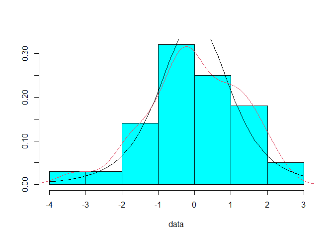
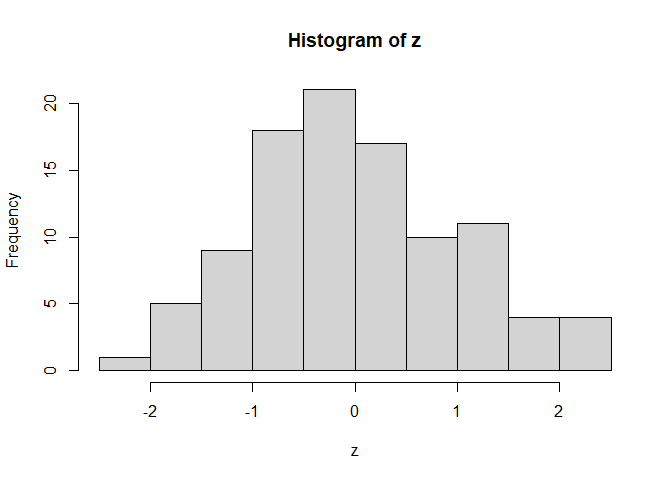
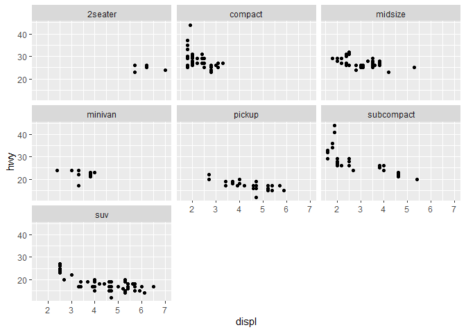
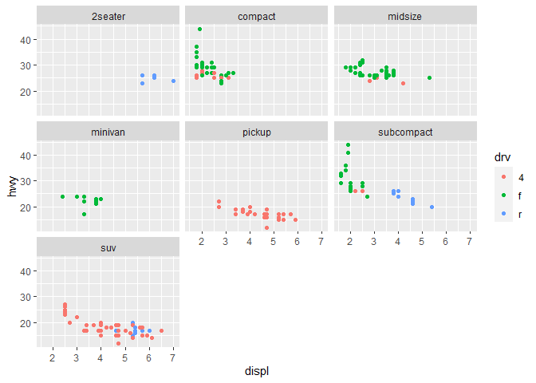

## Ex 1.1

### Problem
Generate a random sample $x1, . . . , x100$ of data from the $t4 (df=4)$ distribution using the $rt$ function. Use the $MASS::truehist$ function to display a probability histogram of the sample.

### Solution

Probability histogram using $MASS::truehist$ function from random sample data.

```r
data <- rt(100, df=4) # random data from df=4 using rt function
MASS::truehist(data) # histogram using MASS::truehist function
```

<!-- -->

## Ex 1.2

### Problem

Add the $t4$ density curve (dt) to your histogram in Exercise 1.1 using the $curve$ function with $add=TRUE$.

### Solution

Added the $t4$ (df = 4) density curve to the histogram.

```r
MASS::truehist(data)
curve(dt(x, df=4), add=TRUE) # added density curve (dt)
```

<!-- -->

## Ex 1.3

### Problem

Add an estimated density curve to your histogram in Exercise 1.2 using density. For example,
$$lines(density(x), col=2)$$
will add the density estimate using the color red. Notice that the density estimate (density) is an approximation to the density of the sampled distribution (in this case the $t4$ density). (Density estimation and the density function are covered in detail in Chapter 12.)

### Solution

Added the estimated density curve to the histogram. 


```r
MASS::truehist(data)
curve(dt(x, df=4), add=TRUE) # added density curve (dt)
lines(density(data), col=2) # added estimated density curve
```

<!-- -->

## Ex 1.4

### Problem

a. Write an R function $f$ in R to implement the function
$$f (x) = \frac{x − a}{b}$$
that will transform an input vector $x$ and return the result. The function should take three input arguments: $x, a, b$.

### Solution
A function $f$ with three input parameters.

```r
f <- function(x, a, b) {
  (x-a)/b
}
```

### Problem

b. To transform $x$ to the interval $[0, 1]$ we subtract the minimum value and divide by the range:
$$y <- f(x, a = min(x), b = max(x) - min(x))$$
Generate a random sample of Normal$(μ = 2, σ = 2)$ data using $rnorm$ and use your function f to transform this sample to the interval $[0, 1]$. Print a summary of both the sample $x$ and the transformed sample $y$ to check the result.

### Solution

Using the previous function $f$ to transform the input to the interval $[0, 1]$. After transform, the max value is $1$, and min value is $0$.

```r
x <- rnorm(100, 2, 2) # random sample using rnorm
y <- f(x, a = min(x), b = max(x) - min(x))

summary(x) # printing the summary
```

```
##    Min. 1st Qu.  Median    Mean 3rd Qu.    Max. 
## -2.2400  0.7096  1.8814  2.0793  3.4265  6.6132
```

```r
summary(y) # printing the summary
```

```
##    Min. 1st Qu.  Median    Mean 3rd Qu.    Max. 
##  0.0000  0.3332  0.4655  0.4879  0.6401  1.0000
```

## Ex 1.5

### Problem

Refer to Exercise 1.4. Suppose that we want to transform the $x$ sample so that it has mean zero and standard deviation one (studentize the sample). That is, we want
$$ z_i = \frac{x_i − x} {s}, i = 1, . . . , n,$$
where $s$ is the standard deviation of the sample. Using your function $f$ this is
$$z <- f(x, a = mean(x), b = sd(x))$$
Display a summary and histogram of the studentized sample $z$. It should be centered exactly at zero. Use $sd(z)$ to check that the studentized sample has standard deviation exactly $1.0$.

### Solution

Now, the Mean is $0$, and standard deviation is $1$.


```r
z <- f(x, a = mean(x), b = sd(x))
summary(z) # summary
```

```
##     Min.  1st Qu.   Median     Mean  3rd Qu.     Max. 
## -2.11892 -0.67193 -0.09711  0.00000  0.66088  2.22413
```

```r
hist(z) # histogram
```

<!-- -->

```r
sd(z) # standard deviation
```

```
## [1] 1
```

## EX 1.6

### Problem

Using your function $f$ of Exercise 1.4, center and scale your Normal$(μ = 2, σ = 2)$ sample by subtracting the sample median and dividing by the sample interquartile range (IQR). Compare your results to Exercise 1.5.

### Solution

After subtracting the sample by median, and dividing the sample by IQR, the results are same as previous results. The Mean is $0$, and standard deviation is $1$.


```r
x = (x - median(x)) / IQR(x) # subtracting by media, dividing by IQR
z <- f(x, a = mean(x), b = sd(x))
summary(z) # summary
```

```
##     Min.  1st Qu.   Median     Mean  3rd Qu.     Max. 
## -2.11892 -0.67193 -0.09711  0.00000  0.66088  2.22413
```

```r
hist(z) # histogram
```

<!-- -->

```r
sd(z) # standard deviation
```

```
## [1] 1
```

## Ex 1.7

### Problem

(ggplot) Refer to Example 1.14 where we displayed an array of scatter-plots using $ggplot$ with facet_wrap. One of the variables in the mpg data is $drv$, a character vector indicating whether the vehicle is front-wheel drive, rear-wheel drive, or four-wheel drive. Add $color = drv$ in aes:
$$aes(displ, hwy, color = drv) $$
and display the revised plot. Your scatterplots should now have the three levels of $drv$ coded by color and the plot should have automatically generated a legend for $drv$ color.

### Solution

Plotting the revised plot using $ggplot2$. 

```r
# Example 1.14
library(ggplot2)
ggplot(mpg, aes(displ, hwy)) + geom_point() + facet_wrap(~ class)
```

<!-- -->

```r
# Revised plot
ggplot(mpg, aes(displ, hwy)) + geom_point() + facet_wrap(~ class) + aes(displ, hwy, color = drv)
```

<!-- -->
