<style type="text/css">
h1.title {
  text-align: center;
}
h4.author {
  text-align: center;
}
h4.date {
  text-align: center;
}
</style>


## Ex 11.1

With $\sigma = 2$, approximately 52% of the candidate points are rejected (so acceptance is about 48%) , so the chain is more inefficient Compare to with $\sigma = 4$ (as in Example 9.1). The trace plot with $\sigma = 2$, we see a rather similar plot, but not surprisingly, over a much less wider range.


```r
f <- function(x, sigma) {
  if (any(x < 0))
    return (0)
  stopifnot(sigma > 0)
  return((x / sigma ^ 2) * exp(-x ^ 2 / (2 * sigma ^ 2)))
}

mc.drayleigh <- function(sigma) {
  m <- 10000
  x <- numeric(m)
  x[1] <- rchisq(1, df = 1)
  k <- 0
  u <- runif(m)
  
  for (i in 2:m) {
    xt <- x[i - 1]
    y <- rchisq(1, df = xt)
    num <- f(y, sigma) * dchisq(xt, df = y)
    den <- f(xt, sigma) * dchisq(y, df = xt)
    if (u[i] <= num / den)
      x[i] <- y
    else {
      x[i] <- xt
      k <- k + 1     #y is rejected
    }
  }
  print(k)
  x
}

# Example 11.1 with sigma = 4
y1 <- mc.drayleigh(4)
```

```
## [1] 4129
```

```r
# Repeat example 11.1 with sigma = 2
y2 <- mc.drayleigh(2)
```

```
## [1] 5242
```

```r
par(mfrow=c(2,1))
index <- 2000:5500
plot(index, y1[index], type = "l", main = "Sigma = 4", ylab = "x")
plot(index, y2[index], type = "l", main = "Sigma = 2", ylab = "x")
```

<div class="figure" style="text-align: center">
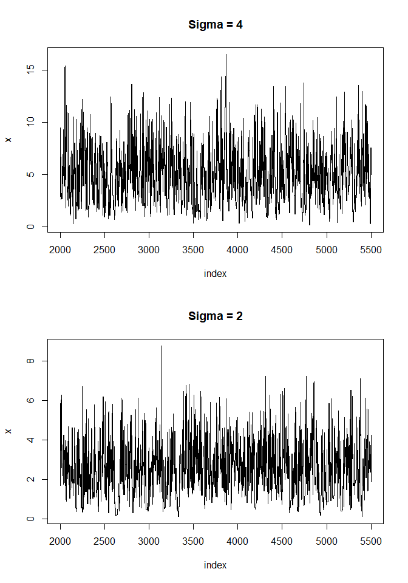
<p class="caption">(\#fig:unnamed-chunk-1)Part of a chain generated by a Metropolis-Hastings sampler of a Rayleigh distribution with sigma = 4, and sigma = 2. Less efficient for sigma = 2, longer horizontal paths in the respective plot</p>
</div>

```r
# range
rbind('(sigma = 4)' = range(y1), "(sigma = 2)" = range(y2))
```

```
##                    [,1]      [,2]
## (sigma = 4) 0.001554573 17.144108
## (sigma = 2) 0.119569700  8.767075
```

## Ex 11.2

The rejection rate is about 30% (lower than that the example 11.1, suggesting higher acceptance and inefficient
mixing).


```r
gamm.dis <- function(sigma) {
  m <- 10000
  x <- numeric(m)
  x[1] <- rgamma(1, 1, 1)
  k <- 0
  u <- runif(m)
  
  for (i in 2:m) {
    xt <- x[i - 1]
    y <- rgamma(1, shape = xt, rate = 1)
    num <- f(y, sigma) * dgamma(xt, shape = y, rate = 1)
    den <- f(xt, sigma) * dgamma(y, shape = xt, rate = 1)
    if (u[i] <= num / den)
      x[i] <- y
    else {
      x[i] <- xt
      k <- k + 1 #y is rejected
    } 
  } 
  
  print(k)
  x
}

## gamma distribution with sigma = 4
y3 <- gamm.dis(4)
```

```
## [1] 3054
```

```r
plot(index, y3[index], type = "l", main = "Sigma = 4", ylab = "x")
```

<div class="figure" style="text-align: center">
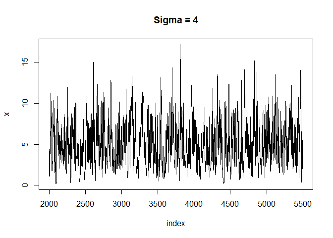
<p class="caption">(\#fig:unnamed-chunk-2)Part of a chain generated by a Metropolis-Hastings sampler of a Gamma distribution with sigma = 4. The plot appears reasonable, and very much similar to its counterpart (with sigma = 4) in example 11.1</p>
</div>

## Ex 11.5

If we regard each hour of testing as a Bernoulli trial, then we have a total of $15*24 + 7*3 + 16 + 21 = 418$ successes and five failures during the 24-hour test period for a total of $423$ trials.


```r
f.mu <- function(x) {
  exp(-lbeta(419, 6) + 418 * log(x) - 418 * log(1 + x) - 6 * log(1 + x))
}
curve(f.mu(x), from=0, to=400, xlab="hours", ylab="")
```

<div class="figure" style="text-align: center">
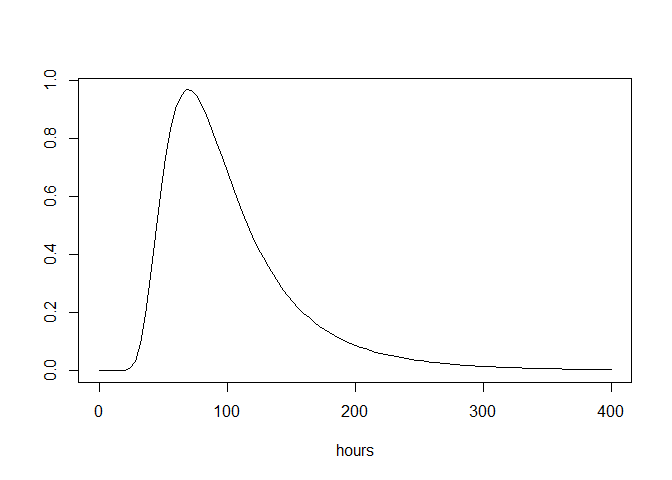
<p class="caption">(\#fig:unnamed-chunk-3)Posterior density of expected future lifetime.</p>
</div>


```r
fr <- function(x, y) {
  a <- 418 * (log(y) - log(x))
  b <- 424 * (log(1 + x) - log(1 + y))
  return(exp(a + b))
}

# MCMC Metropolis-Hastings with gamma proposal
m <- 10000
x <- numeric(m)
a <- 4
x[1] <- rlnorm(1)  #initialize chain
k <- 0
u <- runif(m)
for (i in 2:m) {
  xt <- x[i - 1]
  y <- rgamma(1, shape = a, rate = a / xt)
  r <- fr(xt, y) * dgamma(xt, shape = a, rate = a / y) /
    dgamma(y, shape = a, rate = a / xt)
  if (u[i] <= r)
    x[i] <- y
  else {
    x[i] <- xt
    k <- k + 1     #y is rejected
  }
}

k / m    #proportion rejected
```

```
## [1] 0.3283
```

```r
plot(acf(x))
```

<div class="figure" style="text-align: center">
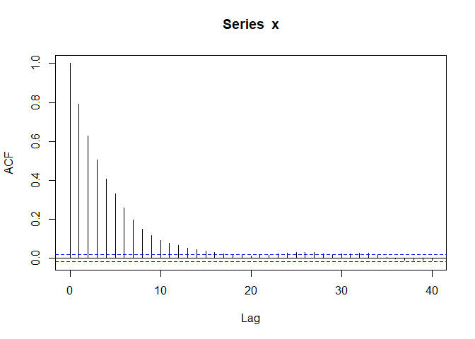
<p class="caption">(\#fig:unnamed-chunk-4)Autocorrelation plots for MCMC chains simulating the posterior distribution of mean residual lifetime.</p>
</div>

This chain with gamma shape parameter set to 4 appears to be mixing well based on the rejection rate $0.3283$.


```r
burnin <- m / 2
X <- x[-(1:burnin)]
hist(
  X,
  prob = TRUE,
  breaks = "scott",
  xlab = bquote(psi),
  main = "MCMC replicates using gamma proposal"
) -> h
curve(f.mu(x), add = TRUE)
```

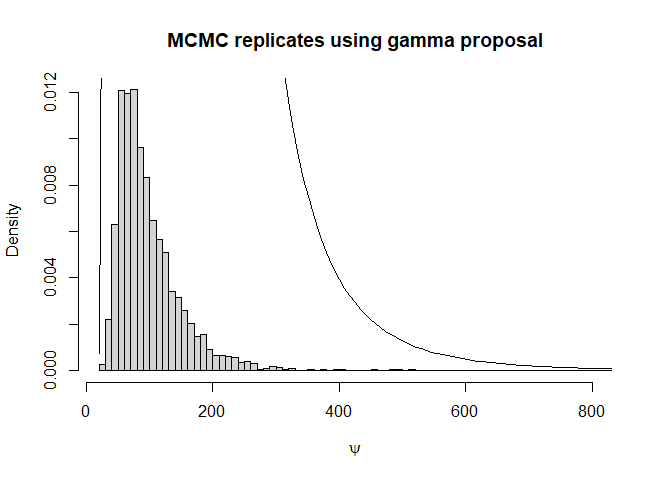<!-- -->

```r
i <- which.max(h$density)  #estimating the mode
h$mids[i]
```

```
## [1] 75
```

```r
q <- quantile(X, c(.025, .975), type = 1)
round(q, 1)     #hours
```

```
##  2.5% 97.5% 
##  39.9 234.1
```

```r
HPDi <- function(x, prob = 0.95) {
  ## HPD interval for a single MCMC chain (a vector)
  x <- sort(x)
  n <- length(x)
  m <- floor(prob * n)
  i <- 1:(n - m)
  L <- x[i + m] - x[i]
  best <- which.min(L)
  return (c(lower = x[best], upper = x[best + m]))
}

HPDi(X) 
```

```
##     lower     upper 
##  29.97845 199.08367
```

## Ex 11.10

Code for a Gibbs sampler for the given binomial/beta construction with $a = 2, b = 3,$ and at $n = 10$.


```r
df <- function (x, y) {
  # general binomial coefficient
  gamma(n + 1) / (gamma(x + 1) * gamma(n - x + 1))  * y^(x + a - 1) * (1 - y)^(n - x + b - 1)
}

gibbs.sam <-  function(m, a, b, n) {
  X <- matrix(0, nrow = m, ncol = 2)
  for (t in 2:m) {
    y <- X[t - 1, 2]
    X[t, 1] <- rbinom(1, size = n, y) #x|y~bin(n,y)
    x = X[t, 1]
    X[t, 2] <-  rbeta(1, x + a, n - x + b) #y|x~beta(x+a,n-x+b)
  }
  return(X)
} 

m = 10000 #size of chain
b0 = 1000 #burn-in
a = 2
b = 3
n = 10
XYGibbs = gibbs.sam(m, a, b, n)
aftburn = b0 + 1

plot(XYGibbs[aftburn:m, ], xlab = 'x', ylab = 'y')
```

<div class="figure" style="text-align: center">
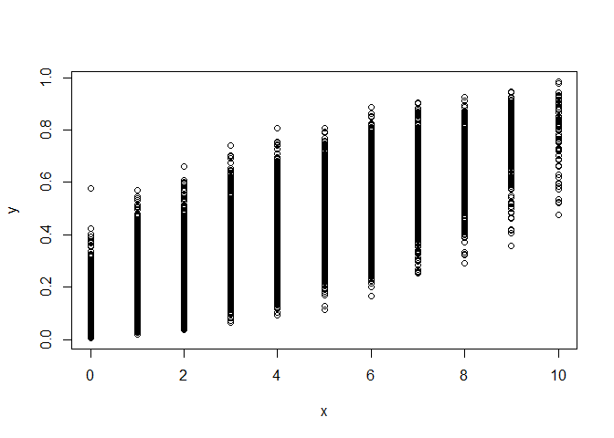
<p class="caption">(\#fig:unnamed-chunk-6)Plot the sampled joint distribution.</p>
</div>


```r
hist(
  XYGibbs[aftburn:m, 2],
  prob = T,
  breaks = 'scott',
  main = '',
  xlab = 'y'
)
```

<div class="figure" style="text-align: center">
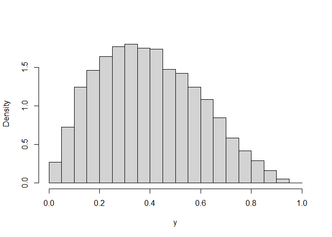
<p class="caption">(\#fig:unnamed-chunk-7)Plot of the sampled marginal posterior distribution of y.</p>
</div>


```r
xGibbs = XYGibbs[aftburn:m, 1]
fx.hat = table(xGibbs) / length(xGibbs)
round(fx.hat, 3)
```

```
## xGibbs
##     0     1     2     3     4     5     6     7     8     9    10 
## 0.063 0.114 0.141 0.146 0.143 0.126 0.101 0.078 0.051 0.029 0.009
```

```r
barplot(
  fx.hat,
  space = 0,
  ylim = c(0, 0.15),
  xlab = "x",
  ylab = 'marginal posterior',
  main = ''
)
```

<div class="figure" style="text-align: center">
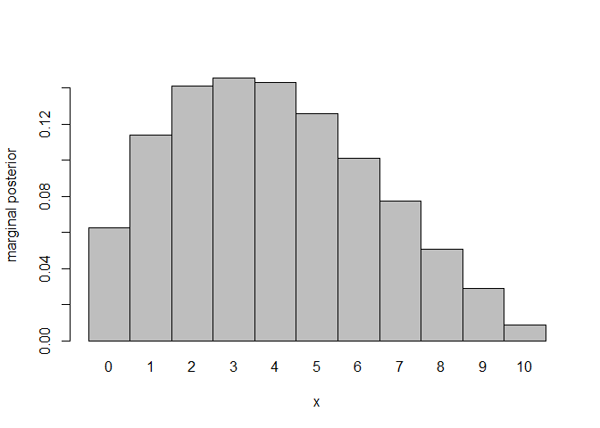
<p class="caption">(\#fig:unnamed-chunk-8)Plot of the marginal posterior distribution of x.</p>
</div>


```r
plot(XYGibbs, cex = 0.1)
xs = seq(from = min(XYGibbs[,1]), to = max(XYGibbs[,1]), length.out = 1000)
ys = seq(from = min(XYGibbs[,2]), to = max(XYGibbs[,2]), length.out = 1000)

zs = t(sapply(xs, function (x) sapply(ys, function (y) df(x, y))))
# plot contour of density for verification.
contour(xs, ys, zs, add = TRUE, col = 2)
```

<div class="figure" style="text-align: center">
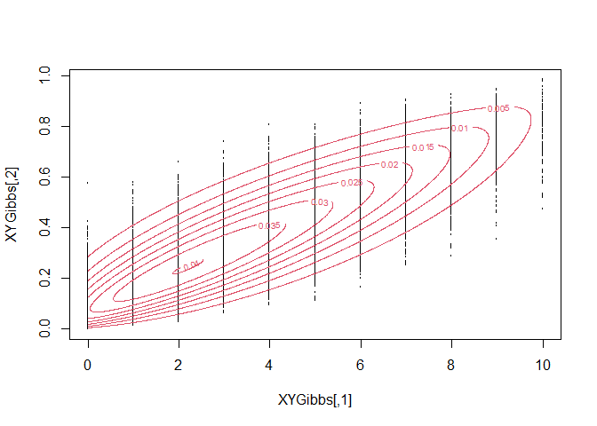
<p class="caption">(\#fig:unnamed-chunk-9)Contour of the density for verification.</p>
</div>

## Ex 11.12

The Gelman.Rubin function gives the G-R convergence diagnostic statistic for the MCMC chain. We see that our chains converge at $b = 1571$, by the constraint $\hat{R} < 1.2$. We also verify this convergence by the $geweke.diag$ function from the $coda$ package.


```r
#Defining the function to calculate the G-R statistic
Gelman.Rubin <- function(psi){
  # psi[i,j] is the statistic psi(X[i,1:j])
  # for chain in i-th row of X
  psi <- as.matrix(psi)
  n <- ncol(psi)
  k <- nrow(psi)
  psi.means <- rowMeans(psi)     #row means
  B <- n * var(psi.means)        #between variance est.
  psi.w <- apply(psi, 1, "var")  #within variances
  W <- mean(psi.w)               #within est.
  v.hat <- W*(n-1)/n + (B/n)     #upper variance est.
  r.hat <- v.hat / W             #G-R statistic
  return(r.hat)
}

f <- function(x, sigma){         #function to evaluate the Rayleigh density
  if (any(x < 0)) return (0)
  stopifnot(sigma > 0)
  return((x / sigma^2) * exp(-x^2 / (2*sigma^2)))
}
k <- 4                           #number of chains to generate
sigma <- 4
x <- as.matrix(c(0.01, 2, 4, 6)) #initializing with overdispersed values
ral.chain <- function(x){        #defining a function to generate one iteration of the chains
  xi <- numeric(nrow(x))
  for(i in 1:length(xi)){
    xt <- x[i, ncol(x)]
    y <- rchisq(1, df = xt)      # Using chi square as the proposal distribution
    num <- f(y, sigma) * dchisq(xt, df = y)
    den <- f(xt, sigma) * dchisq(y, df = xt)
    u <- runif(1)
    if (u <= num/den) {
      xi[i] <- y
    } else{
      xi[i] <- xt
    }
  }
  return(cbind(x,xi))
}
r.hat = 10
while(r.hat >= 1.2){ #continuing the chain till it converges
  x <- ral.chain(x)
  psi <- t(apply(x, 1, cumsum))
  for (i in 1:nrow(psi))
    psi[i,] <- psi[i,] / (1:ncol(psi))
  r.hat <- Gelman.Rubin(psi)
}
b <- ncol(x) 
cbind(b = b, r.hat = r.hat)
```

```
##         b    r.hat
## [1,] 1571 1.199845
```


```r
#plot psi for the four chains
par(mfrow = c(2, 2))
for (i in 1:k)
  plot(psi[i, 1:b], type = "l", xlab = i, ylab = bquote(psi))
```

<div class="figure" style="text-align: center">
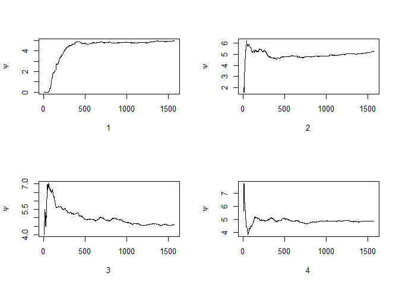
<p class="caption">(\#fig:unnamed-chunk-11)Sequences of the running means psi for four Metropolis-Hastings chains</p>
</div>


```r
par(mfrow = c(1, 1))
#plot the sequence of R-hat statistics
rhat <- rep(0, b)
for (j in 1:b)
  rhat[j] <- Gelman.Rubin(psi[, 1:j])
plot(rhat[1:b], type = "l", xlab = "", ylab = "R")
abline(h = 1.1, lty = 2)
```

<div class="figure" style="text-align: center">
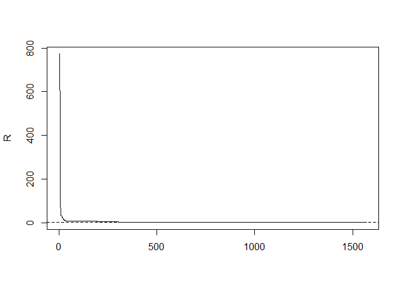
<p class="caption">(\#fig:unnamed-chunk-12)Sequence of the Gelman-Rubin R for four Metropolis-Hastings chains</p>
</div>

Using the coda package to check convergence by the G-R method


```r
# now using the coda package to check convergence by the G-R method
x.mcmc <- mcmc.list(as.mcmc(x[1,]),as.mcmc(x[2,]),as.mcmc(x[3,]),as.mcmc(x[4,]))
geweke.diag(x.mcmc)
```

```
## [[1]]
## 
## Fraction in 1st window = 0.1
## Fraction in 2nd window = 0.5 
## 
##   var1 
## -2.004 
## 
## 
## [[2]]
## 
## Fraction in 1st window = 0.1
## Fraction in 2nd window = 0.5 
## 
##   var1 
## -0.727 
## 
## 
## [[3]]
## 
## Fraction in 1st window = 0.1
## Fraction in 2nd window = 0.5 
## 
##  var1 
## 1.766 
## 
## 
## [[4]]
## 
## Fraction in 1st window = 0.1
## Fraction in 2nd window = 0.5 
## 
##   var1 
## 0.2362
```

```r
geweke.plot(x.mcmc)
```

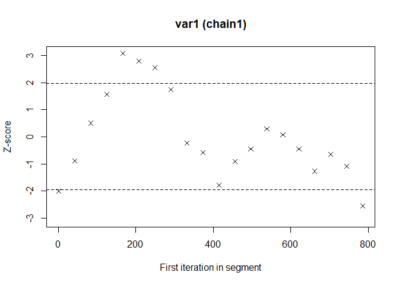<!-- -->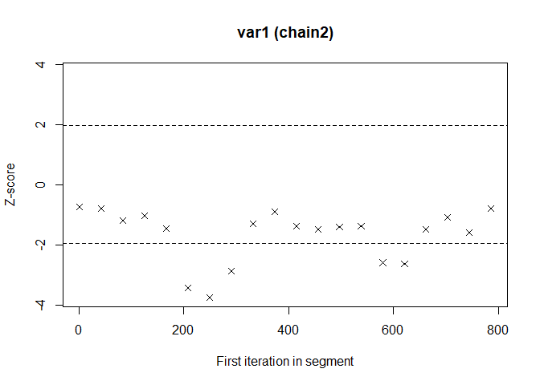<!-- -->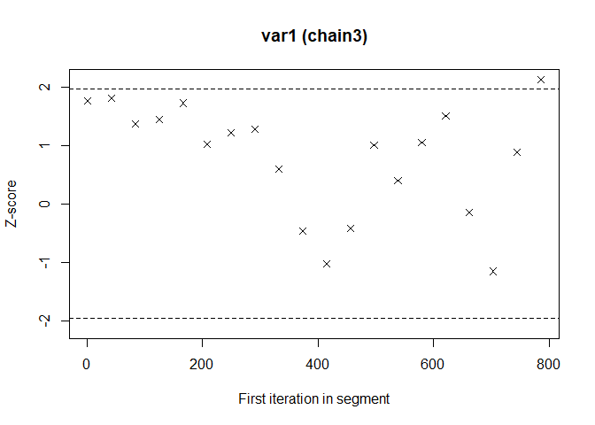<!-- -->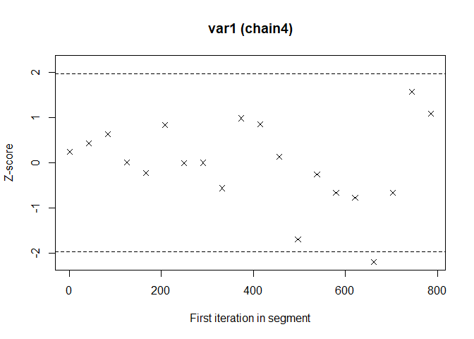<!-- -->
