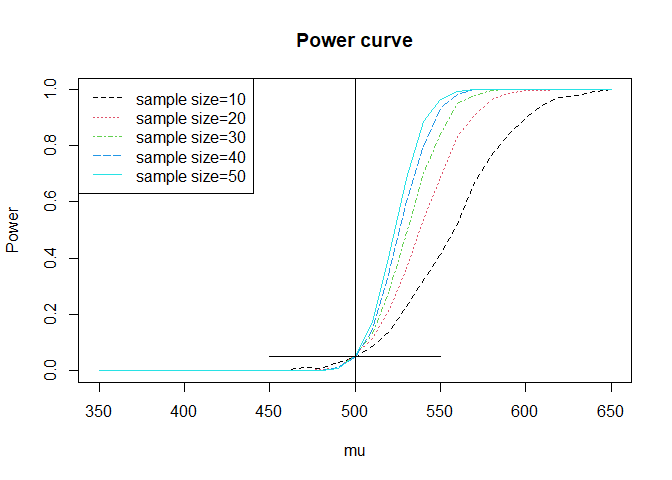
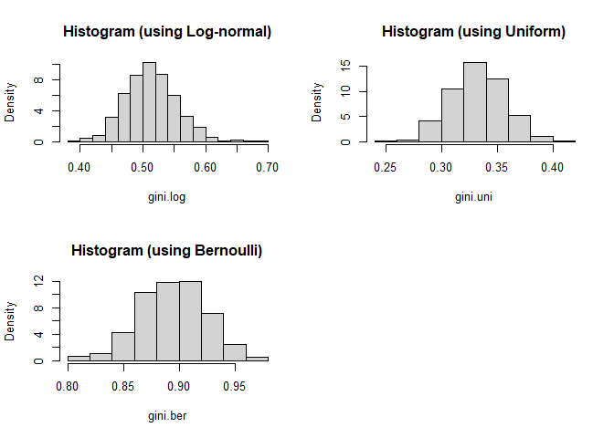

<style type="text/css">
h1.title {
  text-align: center;
}
h4.author {
  text-align: center;
}
h4.date {
  text-align: center;
}
</style>


## Exercise 7.1

Code for estimating the MSE of the level $k$ trimmed means for random samples of size $20$ generated from a standard Cauchy distribution. Summarized the estimates of MSE in a table for $k = 1, 2, . . . , 9$.


```r
m <- 2000
K <- 9
n <- 20
tmean <- matrix(0, m, K)
mse_est <- numeric(K)
mse_se <- numeric(K)
for (k in 1:K) {
  for (i in 1:m) {
    x <- sort(rcauchy(n))
    tmean[i, k] <- mean(x[(k + 1):(n - k)])
  }
  mse_est[k] <- mean(tmean[, k] ^ 2)
  mse_se[k] <- sqrt(sum((tmean[, k] - mean(tmean[, k])) ^ 2)) / m
}
table <- cbind(seq(1:K), round(mse_est, 5), round(mse_se, 5))
colnames(table) <-
  c("k", "Estimated MSE of level k trimmed means", "Standard Error")
knitr::kable(table, caption = 'Estimates of MSE')
```


Table: (\#tab:unnamed-chunk-1)Estimates of MSE

|  k| Estimated MSE of level k trimmed means| Standard Error|
|--:|--------------------------------------:|--------------:|
|  1|                                2.13546|        0.03266|
|  2|                                0.37503|        0.01369|
|  3|                                0.23756|        0.01090|
|  4|                                0.18579|        0.00964|
|  5|                                0.16054|        0.00896|
|  6|                                0.14061|        0.00838|
|  7|                                0.14077|        0.00839|
|  8|                                0.13226|        0.00813|
|  9|                                0.14328|        0.00846|

## Exercise 7.3

Plotting the power curves for the t-test in Example $7.9$ for sample sizes $10, 20, 30, 40,$ and $50$, but omitted the standard error bars. Plotted the curves on the same graph, each in a different color or different line type, and included a legend.


```r
n <- seq(10, 50, 10) #sample size
mu <- c(seq(350, 650, 10))
m <- 1000
M <- length(mu)
N <- length(n)
power <- matrix(0, M, N)
for (j in 1:N) {
  for (i in 1:M) {
    mu1 <- mu[i]
    pvalues <- replicate(m, expr = {
      #simulate under alternative mu1
      x <- rnorm(n[j], mean = mu1, sd = 100)
      ttest <- t.test(x, alternative = "greater", mu = 500)
      ttest$p.value
    })
    power[i, j] <- mean(pvalues <= .05)
  }
}
plot(mu, power[, 1],  type = "l",  lty = 2,  col = 1,  main = "Power curve",  xlab = "mu",  ylab = "Power")

lines(mu, power[, 2], lty = 3, col = 2)
lines(mu, power[, 3], lty = 4, col = 3)
lines(mu, power[, 4], lty = 5, col = 4)
lines(mu, power[, 5], lty = 1, col = 5)

legend(
  "topleft",
  c(
    "sample size=10",
    "sample size=20",
    "sample size=30",
    "sample size=40",
    "sample size=50"
  ),
  lty = c(2, 3, 4, 5, 1),
  col = c(1, 2, 3, 4, 5)
)
abline(v = 500, lty = 1)
lines(c(450, 550), c(0.05, 0.05))
```

<div class="figure" style="text-align: center">

<p class="caption">(\#fig:unnamed-chunk-2)Power Curve. Comment: when sample size increases, the power changes more abruptly.</p>
</div>

## Exercise 7.5

Refer to Example 1.6 (run length encoding). Code for simulation to estimate the probability that the observed maximum run length for the fair coin flipping experiment is in $[9, 11]$ in a sample size of $1000$. Estimated the standard error of the maximum run length for this experiment. 
Suppose that you observed 1000 coin flips and the maximum run length was 9. It might be fair because the probability for maximum run length is between 9 and 11 which is around $0.605$.


```r
n <- 1000
max_run_len <- replicate(n, expr = {
  x <- rbinom(n, size = 1, prob = .5)
  r <- rle(x)
  mx <- max(r$lengths)
  mx
})

prob <- mean(max_run_len >= 9 & max_run_len <= 11)
se <- sd(max_run_len) / sqrt(n)

cbind(probabilty = prob, se=se)
```

```
##      probabilty         se
## [1,]      0.638 0.05964859
```

## Exercise 7.6

My t-interval results is larger than the simulation results in Example $7.4$, so it’s more stable for departures from normality.


```r
alpha <- 0.05
m <- 1000
n <- 20
qt <- qt(1 - alpha / 2, df = n - 1)
LCL <- replicate(m, expr = {
  x <- rchisq(n, 2)
  return(mean(x) - qt * sd(x) / sqrt(n))
})
UCL <- replicate(m, expr = {
  x <- rchisq(n, 2)
  return(mean(x) + qt * sd(x) / sqrt(n))
})
mean((LCL < 2) * (UCL > 2))
```

```
## [1] 0.917
```

## Exercise 7.10

Simulation code and density histogram.


```r
N <- 100
M <- 1000

gini.ratio <- function(x) {
  xi <- numeric(N)
  for (i in 1:N) {
    xi[i] <- (2 * i - N - 1) * x[i]
  }
  sum(xi) / (N * N * mean(x))
}

# standard lognormal
gini.log  <- replicate(M, expr = {
  x <- sort(rlnorm(N))
  gini.ratio(x)
})

# uniform distribution
gini.uni <-  replicate(M, expr = {
  x <- sort(runif(N))
  gini.ratio(x)
})

# Bernoulli(0.1)
gini.ber <-  replicate(M, expr = {
  x <- sort(rbernoulli(N, p = 0.1))
  gini.ratio(x)
})

# Mean, median
result = list(
  mean = c(
    lognormal = mean(gini.log),
    uniform = mean(gini.uni),
    bernoulli = mean(gini.ber)
  ),
  median = c(
    lognormal = median(gini.log),
    uniform = median(gini.uni),
    bernoulli = median(gini.ber)
  )
) %>% as.data.frame()

result
```

```
##                mean    median
## lognormal 0.5132315 0.5116943
## uniform   0.3323549 0.3320427
## bernoulli 0.8991200 0.9000000
```

```r
declies <- seq(0.1, 1, 0.1)
list(
  lognormal = quantile(gini.log, declies),
  uniform = quantile(gini.uni, declies),
  bernoulli = quantile(gini.ber, declies)
) %>% as.data.frame() %>% t()
```

```
##                 10%       20%       30%       40%       50%       60%       70%
## lognormal 0.4640927 0.4792991 0.4896583 0.5018394 0.5116943 0.5212029 0.5327835
## uniform   0.3017622 0.3117842 0.3198044 0.3259732 0.3320427 0.3383400 0.3454829
## bernoulli 0.8600000 0.8700000 0.8800000 0.8900000 0.9000000 0.9100000 0.9200000
##                 80%       90%      100%
## lognormal 0.5456574 0.5665414 0.6887656
## uniform   0.3528131 0.3636429 0.4169381
## bernoulli 0.9300000 0.9400000 0.9800000
```

```r
par(mfrow=c(2,2))
hist(gini.log, probability = TRUE, main = "Histogram (using Log-normal)")
hist(gini.uni, probability = TRUE, main = "Histogram (using Uniform)")
hist(gini.ber, probability = TRUE, main = "Histogram (using Bernoulli)")
```

<div class="figure" style="text-align: center">

<p class="caption">(\#fig:unnamed-chunk-5)Density histograms of the replicates in each case.</p>
</div>

## Project 7.D

Comparison the kurtosis tests of multivariate normality with the energy test of multivariate normality $mvnorm.etest$ (energy)


```r
alpha <- .1
n <- 30
M <- 2500
energy_test <- kutosis_test <- numeric(M)
d <- 2

# calculate kurtosis statistic
kurtosis <- function(x) {
  b <- numeric(n)
  x_ <- matrix(colMeans(x), nrow =  d, ncol =  1)
  for (i in 1:n) {
    xi <- matrix(x[i, ], nrow = d, ncol = 1)
    b[i] <- t(xi - x_) %*% solve(var(x)) %*% (xi - x_)
  }
  sum(b ^ 2) / n
}

# estimate the kurtosis
for (i in 1:M) {
  x <- mlbench.twonorm(n = n, d = d)$x
  kutosis_test[i] <- as.integer(abs((kurtosis(x) - d * (d + 2)) / sqrt(8 * d * (d + 2) / n)) >= qnorm(1 - alpha / 2))
  energy_test[i] <- as.integer(mvnorm.etest(x, R = 200)$p.value <= alpha)
}
cbind(kurtosis = mean(kutosis_test), energy = mean(energy_test))
```

```
##      kurtosis energy
## [1,]   0.3128    0.4
```
