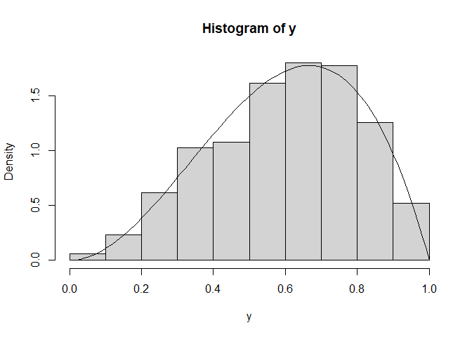
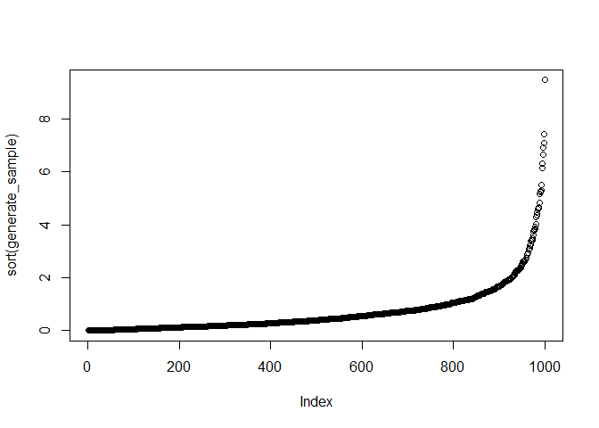

## Ex 3.1

A function for generate random sample from the two-parameter exponential distribution. Later, the comparison of the sample quantiles with the theoretical quantiles 


```r
# Two parameter exponential distribution
two_exponential <- function(n, lamda, eta) {
  # Uniform Distribution
  r <- runif(n)
 1 - exp(-lamda*(r-eta)) 
}

n <- 10000
lambda <- 2
eta <- 0

# generating random sample
a <- two_exponential(n, lambda, eta) 
x <- quantile(a)

# using r function
b <- rexp(n, lambda)
y <- quantile(b)

# printing the result by combing 
round(rbind(x,y), digits = 3)
```

```
##   0%   25%   50%   75%  100%
## x  0 0.397 0.635 0.779 0.865
## y  0 0.146 0.348 0.699 4.230
```

## Ex 3.3

Inverse transformation $F^{-1}(U)$
$$
F(X) = U,\\
uniform(0,1) -> U\\
1 - (\frac{b}{x})^a = u,\\
x = b(1 - u )^\frac{-1}{a}
$$
Pareto probability density function
$$
P(x)=	\frac{ab^a}{x^{a+1}}
$$
Using the inverse transform method to generate random sample from Pareto distribution. Drawing histogram with pareto density for comparison.


```r
paretoInverse <- function(x, a, b) {
  u <- runif(x)
  b*(1-u)^(-1/a)
}

paretoDensity <- function (x, a, b) {
  sapply(x, function(s) a*b^a*s^(-a-1))
}

n <- 1000
a <- 2
b <- 2

random_sample <- paretoInverse(n, a, b)
range_sample <- range(random_sample)
x <- seq(range_sample[1], range_sample[2], 0.01)
y <- paretoDensity(x,a,b)
# histogram for sample
hist(random_sample, probability = TRUE, breaks = 100)
# density curve superimposed 
lines(x = x, y = y)
```

<!-- -->

## Ex 3.5

Generate random sample using inverse transform method and construct a relative frequency table. Repeat the process using R function for comparison. 


```r
# inverse transform
inverseTransform <- function (size, x, px) {
  u <- runif(size)
  c <- cumsum(px)
  sapply(u, function(v) min(x[c >= v]))
}

x <- 0:4
px <- c(0.1, 0.2, 0.2, 0.2, 0.3)
size <- 1000

# generate sample using function
generate_sample <- inverseTransform(size, x, px)
r1 <- table(generate_sample)

# generating sample using R function
r_sample <- sample(size = size, x = x, prob = px, replace = TRUE)
r2 <- table(r_sample)

rbind(r1, r2)/size
```

```
##        0     1     2     3     4
## r1 0.101 0.196 0.234 0.193 0.276
## r2 0.092 0.187 0.243 0.181 0.297
```

# Ex 3.7

A function for generating random sample using accept-rejection method from Beta(a, b) distribution. Drawing histogram and Beta(a,b) density. 

```r
sample_beta <- function(n,a,b,...){
  k <- 0 #counter for accepted
  y <- numeric(n)

  while (k < n) {
    u <- runif(1)
    x <- runif(1) #random variate from g
    if (x^(a-1) * (1-x)^(b-1) > u) {
      #we accept x
      k <- k + 1
      y[k] <- x
    }
  }
  y
}
##Generate a sample of size 1000 from the Beta(3,2) distribution
n <- 1000
y <- numeric(n)
y <- sample_beta(n,3,2) #Using the beta function

##compare empirical and theoretical percentiles
p <- seq(.1, .9, .1)
Qhat <- quantile(y, p) #quantiles of sample
Q <- qbeta(p, 3, 2) #theoretical quantiles
se <- sqrt(p * (1-p) / (n * dbeta(Q, 3, 2)))

round(rbind(Qhat, Q, se), 3)
```

```
##        10%   20%   30%   40%   50%   60%   70%   80%   90%
## Qhat 0.313 0.403 0.496 0.560 0.618 0.670 0.728 0.789 0.859
## Q    0.320 0.418 0.492 0.555 0.614 0.671 0.728 0.788 0.857
## se   0.010 0.011 0.012 0.012 0.012 0.012 0.011 0.010 0.008
```

```r
hist(y,prob = TRUE)
curve(dbeta(x,3,2),add=TRUE)
```

<!-- -->

# Ex 3.8

Generating random sample using lognormal. Histogram using the function and R function for comparison. 


```r
# lognormal using logarithms and normal distribution
lognormal <- function (size, mu, sigma) {
  exp(rnorm(n = size, mean = mu, sd = sigma))
}

mu <- 1
sigma <- 0.25
size <- 1000

# generating random sample
generate_sample <- lognormal(size = size, mu = mu, sigma = sigma)
hist(generate_sample)
```

<!-- -->

```r
# R function for lognormal distribution
r_sample <- rlnorm(n = size, meanlog = mu, sdlog = sigma)
hist(r_sample)
```

<!-- -->

# Ex 3.12

Generating random observations from Exponential-Gamma mixture with r = 4 and beta = 2. Plotting sample and drawing histogram for simulation.


```r
size <- 1000
r <- 4
beta <- 2

# Exponential distribution 
expo_gamma <- function (size, r, beta) {
  rexp(n = size, rgamma(n = size, r, beta))
}

generate_sample <- expo_gamma(size = size, r = r, beta = beta)

# plotting the sample
plot(sort(generate_sample))
```

<!-- -->

```r
# histogram
hist (generate_sample, probability = TRUE, breaks = 100, ylim = c(0, 2))
```

<!-- -->

# Ex 3.13

Used pareto distribution for previous exercise. Drawing the density curve on the histogram for comparison. 


```r
xs <- seq(min(generate_sample), max(generate_sample), 0.01)
hist (generate_sample, probability = TRUE, breaks = 100, ylim = c(0, 2))
lines(x = xs, y = paretoDensity(xs, a = r, b = beta))
```

<!-- -->

# Ex 3.15

Function for standardize the multivariate normal sample. 


```r
standardize <- function (data) {
  Sigma <- cov(data)
  mus <- sapply(1:ncol(data), function (v) mean(data[,v]))
  A <- chol(solve(Sigma))
  Xs <- t(A %*% (t(data)-mus))
  Xs
}

d <- 2
n <- 1000 
mu <- c(9,10)
sigma <- matrix(c(3,2,2,5),2,2) 

r <- mvrnorm(n,mu,sigma)
# variance before standardize
var(r)
```

```
##          [,1]     [,2]
## [1,] 3.062388 2.061451
## [2,] 2.061451 5.031153
```

```r
rr <- standardize(r)
# variance after standardize
var(rr)
```

```
##              [,1]         [,2]
## [1,] 1.000000e+00 2.018816e-17
## [2,] 2.018816e-17 1.000000e+00
```

# Ex 3.18

Generate random sample from Wishart distribution.


```r
wishart <- function (Sigma, n) {
  d <- ncol(Sigma)
  L <- chol(Sigma)
  tmp <- matrix(rnorm(d^2), ncol = d, nrow = d)
  tmp[upper.tri(tmp, diag = TRUE)] <- 0
  A <- diag(sapply(1:d, function (v) rchisq(1, n - v + 1))) + tmp
  t(L) %*% A %*% t(A) %*% L
}

Sigma <- matrix(c(1, -0.5, 0.5, -0.5, 2, -0.5, 0.5, -0.5, 3), ncol = 3)
n <- 4
size <- 1000

sam <- lapply(1:size, function (v) wishart(Sigma, n))

(mean <- apply(simplify2array(sam), 1:2, mean))
```

```
##           [,1]       [,2]      [,3]
## [1,]  22.62955 -11.249110 11.863406
## [2,] -11.24911  35.314303 -9.989951
## [3,]  11.86341  -9.989951 34.392027
```

```r
sd <- apply(simplify2array(sam), 1:2, sd)

(truth.mean <- n * Sigma)
```

```
##      [,1] [,2] [,3]
## [1,]    4   -2    2
## [2,]   -2    8   -2
## [3,]    2   -2   12
```
