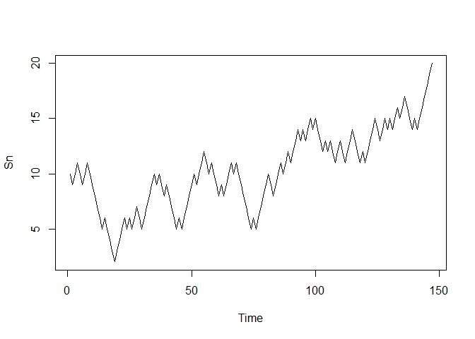

## Ex 4.1

### Problem
Suppose that A and B each start with a stake of $10, and bet $1 on consecutive coin flips. The game ends when either one of the players has all the money. Let S n be the fortune of player A at time n. Then ${S_n , n ≥ 0}$ is a symmetric random walk with absorbing barriers at 0 and 20. Simulate a realization of the process ${S_n , n ≥ 0}$ and plot $S_n$ vs. the time index from time 0 until a barrier is reached.

### Soultion

Simulated the realization of the process and plotted the diagram $S_n$ vs Time index.


```r
# start position
cur <- 10
# generate random walk for 1000
n <- 1000
incr <- sample(c(-1, 1), size = n, replace = TRUE)
# simulate the game until reached 0 or 20
i <- 1
Sn <- c(cur)
while (cur > 0 && cur < 20) {
  cur <- cur + incr[i]
  Sn <- c(Sn, cur)
  i <- i+1
}
# ploting Sn vs time
plot(1:length(Sn), Sn, type = "l", main = "", xlab = "Time")
```

<!-- -->

## Ex 4.3

### Problem

A nonhomogeneous Poisson process has mean value function
$$m(t) = t^2 + 2t, t ≥ 0.$$
Determine the intensity function $λ(t)$ of the process, and write a program to simulate the process on the interval $[4, 5]$. Compute the probability distribution of $N (5) − N (4)$, and compare it to the empirical estimate obtained by replicating the simulation.

### Solution

Computed the probability distribution of $N(5)-N(4)$ using nonhomogeneous process.


```r
n <- 10000 ## number of simulation reps
lambda <- 3; upper <- 100
y <- replicate(n, expr = {
    N <- rpois(1, lambda * upper)
    Tn <- rexp(N, lambda)
    Sn <- cumsum(Tn)
    Un <- runif(N)
    keep <- (Un <= (2 * Sn + 2))    ## indicator, as logical vector
    sum( Sn[keep] > 4 & Sn[keep] <= 5 ) ## time at [4,5]
})

# mean
(mean(y))
```

```
## [1] 3.0077
```

```r
# variance
(var(y))
```

```
## [1] 3.011742
```

```r
# numeric integration
integrate(f = function(t) {(2*t+2)} ,lower = 4, upper = 5)
```

```
## 11 with absolute error < 1.2e-13
```
