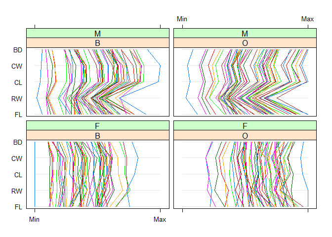

# Exercise 5.3

Generated a bivariate random sample from the join distribution of (X, Y), where X and Y are independent. Here, $P_1$ is used $0.5$.


```r
# Normal mixture distribution
mixture <- function(n, p) {
  x1 <- rnorm(n, 0, 1)
  x2 <- rnorm(n, 3, 1)
  r <- sample(c(0, 1), n, replace = TRUE, prob = c(p, 1-p))
  r * x1 + (1 - r) * x2
}
random_sample <- function(p1) {
  x <- sort(mixture(100, p1))
  y <- sort(mixture(100, p1))
  
  # function for bivariate distribution density
  f <- function(x) {
    p1 * dnorm(x, 0, 1) + (1 - p1) * dnorm(x, 3, 1)
  }
  
  # join distribution by multipling as they are independent
  r <- sapply(x, function(x) {
    sapply(y, function(y) {
      f(x) * f(y)
    })
  })
  r
}
# P1 = 0.5
z <- random_sample(0.5)
```

```r
# contour plot, nubmer of contour levels took 10 for making prettier figure.
contour(z, levels = pretty(range(z), 10))
```

<div class="figure" style="text-align: center">

<p class="caption">(\#fig:unnamed-chunk-2)A contour plot of a bivariate random sample generated from the joint distribution of $(X, Y)$</p>
</div>

# Exercise 5.4

Constructing a filled contour plot of the bivariate mixture of the previous exercise.


```r
filled.contour(z, color = terrain.colors, asp = 1)
```

<div class="figure" style="text-align: center">

<p class="caption">(\#fig:unnamed-chunk-3)A filled contour plot of a bivariate random sample generated from the joint distribution of $(X, Y)$</p>
</div>

# Exercise 5.5

Constructing a surface plot of the bivariate mixture of the previous exercise.


```r
persp(z, theta = 45, phi = 30, expand = 0.5, ltheta = 120, shade = 0.75, ticktype = "detailed", xlab = "X", ylab = "Y", zlab = "f(x, y)")
```

<div class="figure" style="text-align: center">

<p class="caption">(\#fig:unnamed-chunk-4)A surface plot of a bivariate random sample generated from the joint distribution of $(X, Y)$</p>
</div>

# Exercise 5.6

Repeating the exercise 5.3 for different parameters. Here, $p_1$ is used as $0.4, 0.5, 0.6, 0.7$. Here, density is changed based on the probability.


```r
par(mfrow=c(2,2))
p <- c(0.4, 0.5, 0.6, 0.7)
plots <- lapply(p, function(p1){
  z <- random_sample(p1)
  contour(z, main= paste("P = ", p1))
})
```

<div class="figure" style="text-align: center">

<p class="caption">(\#fig:unnamed-chunk-5)Contour plots for differents parameters, $P_1$ for $0.4, 0.5, 0.6, 0.7$</p>
</div>


# Exercise 5.7

Creating paraller coordinate plots of the crabs (MASS) data set. After adjusting the measurements by the size the differences are more visible.


```r
x <- MASS::crabs
a <- x$CW * x$CL #area of carapace
parallelplot(~x[4:8] | sp*sex, x)
```

<div class="figure" style="text-align: center">

<p class="caption">(\#fig:unnamed-chunk-6)Parallel coordinate plots. Differences between species (B=blue, O=orange) and sex (M, F) are largely obscured by large variation in overall size.</p>
</div>

```r
parallelplot(~(x[4:8]/sqrt(a)) | sp*sex, x)
```

<div class="figure" style="text-align: center">

<p class="caption">(\#fig:unnamed-chunk-7)Parallel coordinate plots after adjusting the measurements for size of individual crabs, differences between groups are obvious.</p>
</div>

# Exercise 5.11

A segment style stats plot for leaf measurements at latitude 42 for leafshape (DAAG) data set. $$0=orthotropic, 1=plagiotropic$$


```r
x <- DAAG::leafshape
sb <- subset(x, latitude == 42)
palette(rainbow(6))
stars(sb[1:3], draw.segments = TRUE, labels = sb$arch, nrow = 3, ylim = c(-2,10), key.loc = c(3,-1))
```

<div class="figure" style="text-align: center">

<p class="caption">(\#fig:unnamed-chunk-8)A segment style stars plot for leaf measurements at latitude 42 (Tasmania)</p>
</div>


```r
x <- DAAG::leafshape
sb <- subset(x, latitude == 42)
palette(rainbow(6))
stars(sb[5:7], draw.segments = TRUE, labels = sb$arch, nrow = 3, ylim = c(-2,10), key.loc = c(3,-1))
```

<div class="figure" style="text-align: center">

<p class="caption">(\#fig:unnamed-chunk-9)A segment style stars plot for leaf measurements at latitude 42 (Tasmania) using the logarithms of the measurements</p>
</div>

# Exercise 5.12

Generating PCA plots by describing steps of the problems.


```r
x <- scale(scor) #center and scale
pc <- prcomp(scor, center = TRUE, scale = TRUE)
dg <- diag(1/pc$sdev) # diagonal matrix
z <- x  %*% pc$rotation %*% dg 

par(mfrow=c(1,2))
par(pty = "s")
# plot with empty point type
plot(z[ ,1], z[, 2], type = "n", xlab = "PC1", ylab = "PC2", main="(a)")
# label the point as number
text(z, labels = as.character(1:nrow(x)), col = 'red')

# Example 3.14
biplot(pc, pc.biplot = TRUE, main = "(b)")
```

<div class="figure" style="text-align: center">

<p class="caption">(\#fig:unnamed-chunk-10)(a) A scatterplot of the first two PCs, (b) the PCA biplot of Example 5.14 (Figure 5.14). The points are matched to each other.</p>
</div>

# Exercise 5.13

Adding the arrows to the plot using $arrows$ function.


```r
par(mfrow=c(1,2))
par(pty = "s")

# plot with empty point type
plot(z[ ,1], z[, 2], type = "n", xlab = "PC1", ylab = "PC2", main="(a)")
# level the point as number
text(z, labels = as.character(1:nrow(x)), col = 'red')
# adding arrows
cr <- 2.5 * pc$rotation %*% diag(pc$sdev)
arrows(x0 = 0, y0 = 0, x1 = cr[, 1], y1 = cr[, 2])
text(cr, labels = colnames(scor))

# Example 3.14
biplot(pc, pc.biplot = TRUE, main = "(b)")
```

<div class="figure" style="text-align: center">

<p class="caption">(\#fig:unnamed-chunk-11)(a) Added the arrows to your plot of Exercise 5.12, (b) the PCA biplot of Example 5.14 (Figure 5.14). The arrows of the both plots matched to each other.</p>
</div>

# Exercise 3.16

Displaying biplots for $(PC1, PC2), (PC1, PC3), (PC1, PC4),$ and $(PC2, PC3)$ without the individuals’ labels.


```r
library(FactoMineR)
data(decathlon)

pc <- princomp(decathlon[,1:10], cor = TRUE, scores = TRUE)

summary(pc)
```

```
## Importance of components:
##                           Comp.1    Comp.2    Comp.3    Comp.4     Comp.5
## Standard deviation     1.8088409 1.3180027 1.1852918 1.0280323 0.82751044
## Proportion of Variance 0.3271906 0.1737131 0.1404917 0.1056850 0.06847735
## Cumulative Proportion  0.3271906 0.5009037 0.6413953 0.7470804 0.81555771
##                            Comp.6     Comp.7     Comp.8     Comp.9    Comp.10
## Standard deviation     0.77412446 0.67174047 0.62998142 0.46348123 0.42688111
## Proportion of Variance 0.05992687 0.04512353 0.03968766 0.02148149 0.01822275
## Cumulative Proportion  0.87548458 0.92060811 0.96029577 0.98177725 1.00000000
```


```r
plot(pc)
```

<div class="figure" style="text-align: center">

<p class="caption">(\#fig:unnamed-chunk-13)Screeplot of the variances.</p>
</div>


```r
par(mfrow = c(2, 2))
biplot(pc, choices = c(1, 2), pc.biplot = T, xlab = "PC1", ylab = "PC2", xlabs = rep("", nrow(decathlon)), col = 'red', main = "(a)")
biplot(pc, choices = c(1, 3), pc.biplot = T, xlab = "PC1", ylab = "PC3", xlabs = rep("", nrow(decathlon)), col = 'red', main = "(b)")
biplot(pc, choices = c(1, 4), pc.biplot = T, xlab = "PC1", ylab = "PC4", xlabs = rep("", nrow(decathlon)), col = 'red', main = "(c)")
biplot(pc, choices = c(2, 3), pc.biplot = T, xlab = "PC2", ylab = "PC3", xlabs = rep("", nrow(decathlon)), col = 'red', main = "(d)")
```

<div class="figure" style="text-align: center">

<p class="caption">(\#fig:unnamed-chunk-14)Biplots of PCA without the individuals’ labels. (a) $(PC1, PC2)$, (b) $(PC1, PC3)$, (c) $(PC1, PC4)$, (d) $(PC2, PC3)$. Most of the cases, Shot.put, Discuss, High.jump are close to each other and not much correlated to 100m, 400m.</p>
</div>
