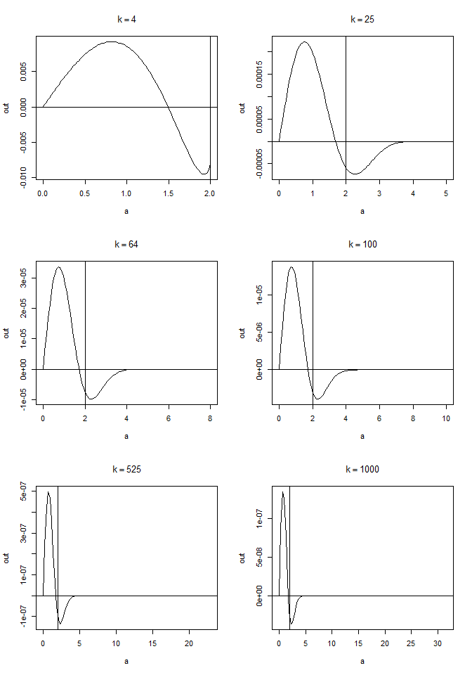
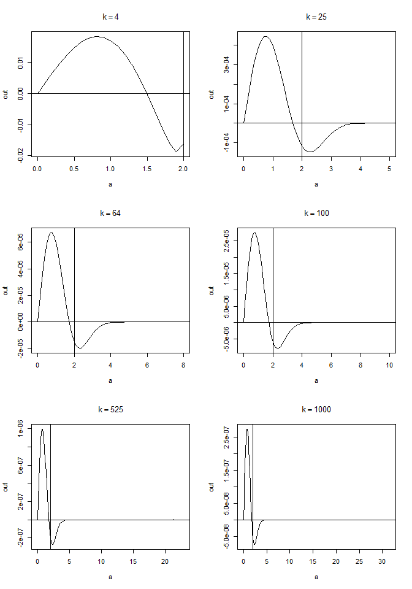

<style type="text/css">
h1.title {
  text-align: center;
}
h4.author {
  text-align: center;
}
h4.date {
  text-align: center;
}
</style>


## Ex 13.3


```r
# get term function (a) a function to compute the kth term
getTerm <- function (a, k) {
  d <- length(a)
  (-1) ^ k * exp((2 * k + 2) * log(norm(a, type = "2"))
                  - lgamma(k + 1) - k * log(2) - log(2 * k + 1) - log(2 * k + 2)
                  + lgamma((d + 1) / 2) + lgamma(k + 3 / 2) - lgamma(k + d / 2 + 1))
}


a <- c(1,2)
getTerm(a, 100)
```

```
## [1] 7.232135e-124
```

```r
# for large k
getTerm(a, 10000)
```

```
## [1] 0
```

```r
## (b) Modify the function so that it computes and returns the sum.
n <- 4000
# function to get sum
getSum <- function (a) {
  sum(sapply(0:n, function (k) getTerm(a, k)))
}

## (c) Evaluate the sum
getSum(a)
```

```
## [1] 1.532164
```


## Ex 13.4

The t-probabilities are found via the $pt()$ function. The intersection of the two functions $S_{k–1}(a)$ and $S_k(a)$ occurs when their difference is zero. A quick plot of selected differences $S_k(a) – S_{k–1}(a)$ shows that the likely solutions occur in the interval $0 < a <= 2$, so use this as the capture interval for application of Brent’s method. Sample R code:


```r
object <- function(a, df) {
  a2 <- a ^ 2
  arg <- sqrt(a2 * df / (df + 1 - a2))
  Sk <- pt(q = arg, df = df)
  arg <- sqrt(a2 * (df - 1) / (df - a2))
  Skm1 <- pt(q = arg, df = df - 1)
  return(Sk - Skm1)
} #end function

par(mfrow=c(3,2))
k <- c(4, 25, 64, 100, 525, 1000)
for (n in k) {
  a <- seq(0, sqrt(n), length.out = 100)
  out <- object(a,n)
  plot(a, out, type = 'l', main = bquote(k == .(n)))
  abline(h = 0, v = 2)
}
```

<div class="figure" style="text-align: center">

<p class="caption">(\#fig:unnamed-chunk-2)Different plot to choose the bounds in uniroot.</p>
</div>

```r
k <- c(4:25, 100, 500, 1000)
out4 <- numeric(length(k))
for (i in 1:length(k)) {
  out4[i] <- uniroot(object, lower = 0.01, upper = 2, df = k[i])$root
}

out4
```

```
##  [1] 1.492103 1.533554 1.562745 1.584430 1.601185 1.614522 1.625391 1.634420
##  [9] 1.642039 1.648555 1.654192 1.659115 1.663454 1.667305 1.670747 1.673841
## [17] 1.676638 1.679179 1.681497 1.683621 1.685573 1.687374 1.720606 1.729753
## [25] 1.730905
```

## Ex 13.5

Sample R code for solving the given equation.


```r
solve.equation <- function (a, k) {

  # general integral.  
  expr.integral <- function(u, n) {
    (1 + u ^ 2 / (n)) ^ (-(n + 1) / 2)
  }
  
  # general c_k.
  get.c <- function (n, a) {
    sqrt(a ^ 2 * n / (n + 1 - a ^ 2))
  }
  
  # left or right side of the equation, depending wheather n = k or n = k - 1.
  expr <- function (n, a) {
    this.integral <- function (u) {
      expr.integral(u, n)
    }
    
    c <- get.c(n, a)
    
    2 / sqrt(pi * (n)) * exp(lgamma((n + 1) / 2) - lgamma((n) / 2)) * integrate(this.integral, lower = 0, upper = c)$value
  }
  
  
  left <- expr(k, a)
  right <- expr(k - 1, a)
  return (left - right)
}

par(mfrow=c(3,2))
k <- c(4, 25, 64, 100, 525, 1000)
for (n in k) {
  a <- seq(0, sqrt(n), 0.1)
  out <- sapply(a, solve.equation, n)
  plot(a, out, type = 'l', main = bquote(k == .(n)))
  abline(h = 0, v = 2)
}
```

<div class="figure" style="text-align: center">

<p class="caption">(\#fig:unnamed-chunk-3)Different plot to choose the bounds in uniroot.</p>
</div>

```r
k <- c(4:25, 100, 500, 1000)
out5 <- numeric(length(k))
for (i in 1:length(k)) {
  out5[i] <- uniroot(solve.equation, lower = 0.01, upper = 2, k = k[i])$root
}
out5
```

```
##  [1] 1.492103 1.533554 1.562745 1.584430 1.601185 1.614522 1.625391 1.634420
##  [9] 1.642039 1.648555 1.654192 1.659115 1.663454 1.667305 1.670747 1.673841
## [17] 1.676638 1.679179 1.681497 1.683621 1.685573 1.687374 1.720606 1.729753
## [25] 1.730905
```

```r
rbind(Ex13.4 = out4,
      Ex13.5 = out5,
      dif = round(out5 - out4, 2))
```

```
##            [,1]     [,2]     [,3]    [,4]     [,5]     [,6]     [,7]    [,8]
## Ex13.4 1.492103 1.533554 1.562745 1.58443 1.601185 1.614522 1.625391 1.63442
## Ex13.5 1.492103 1.533554 1.562745 1.58443 1.601185 1.614522 1.625391 1.63442
## dif    0.000000 0.000000 0.000000 0.00000 0.000000 0.000000 0.000000 0.00000
##            [,9]    [,10]    [,11]    [,12]    [,13]    [,14]    [,15]    [,16]
## Ex13.4 1.642039 1.648555 1.654192 1.659115 1.663454 1.667305 1.670747 1.673841
## Ex13.5 1.642039 1.648555 1.654192 1.659115 1.663454 1.667305 1.670747 1.673841
## dif    0.000000 0.000000 0.000000 0.000000 0.000000 0.000000 0.000000 0.000000
##           [,17]    [,18]    [,19]    [,20]    [,21]    [,22]    [,23]    [,24]
## Ex13.4 1.676638 1.679179 1.681497 1.683621 1.685573 1.687374 1.720606 1.729753
## Ex13.5 1.676638 1.679179 1.681497 1.683621 1.685573 1.687374 1.720606 1.729753
## dif    0.000000 0.000000 0.000000 0.000000 0.000000 0.000000 0.000000 0.000000
##           [,25]
## Ex13.4 1.730905
## Ex13.5 1.730905
## dif    0.000000
```

The results are exactly same and their difference is $0$.


## Ex 14.1

The simplex algorithm to solve the problem (minimization). 


```r
A1 <- rbind(c(2, 1, 1), c(1, -1, 3))
b1 <- c(2, 3)
a <- c(4, 2, 9)
boot::simplex(a = a, A1 = A1, b1 = b1)
```

```
## 
## Linear Programming Results
## 
## Call : boot::simplex(a = a, A1 = A1, b1 = b1)
## 
## Minimization Problem with Objective Function Coefficients
## x1 x2 x3 
##  4  2  9 
## 
## 
## Optimal solution has the following values
## x1 x2 x3 
##  0  0  0 
## The optimal value of the objective  function is 0.
```
