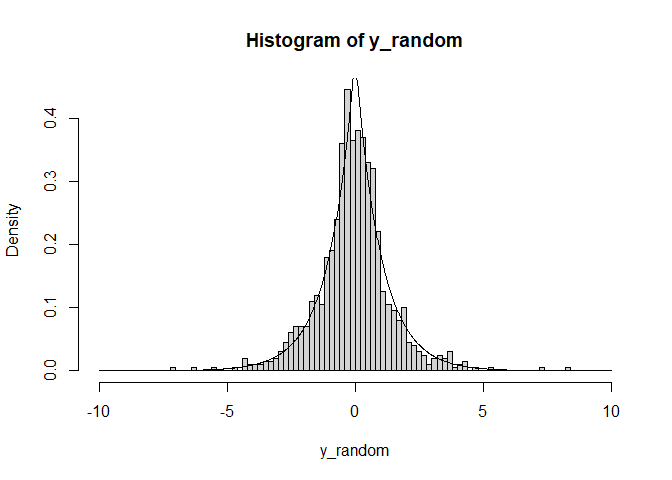
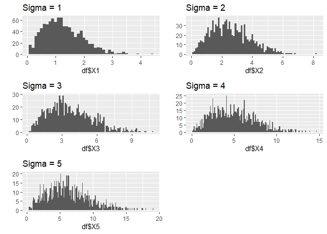
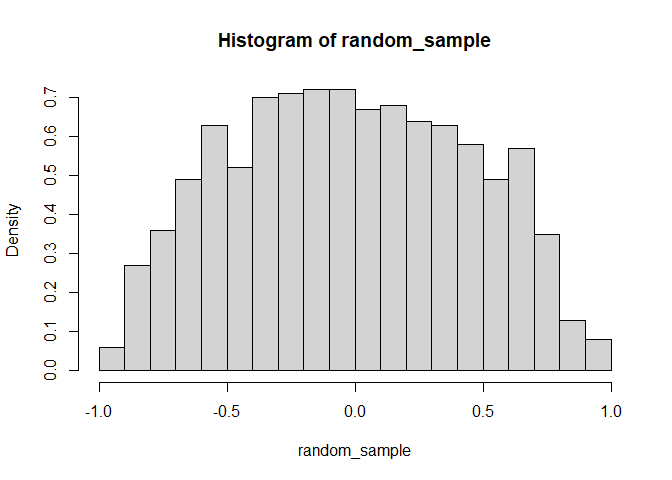
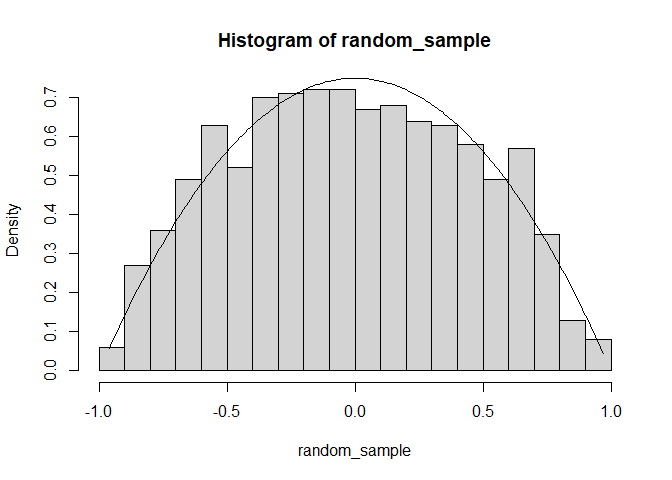
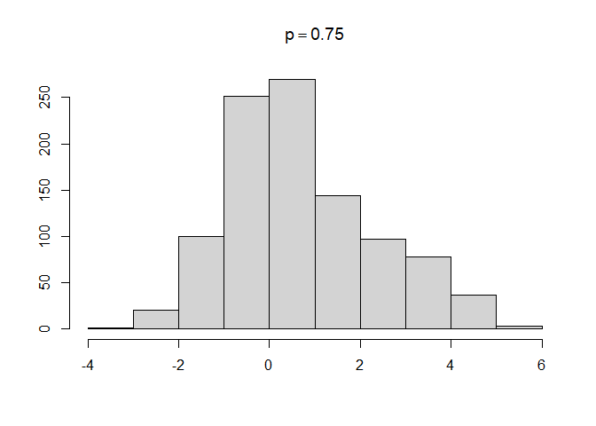
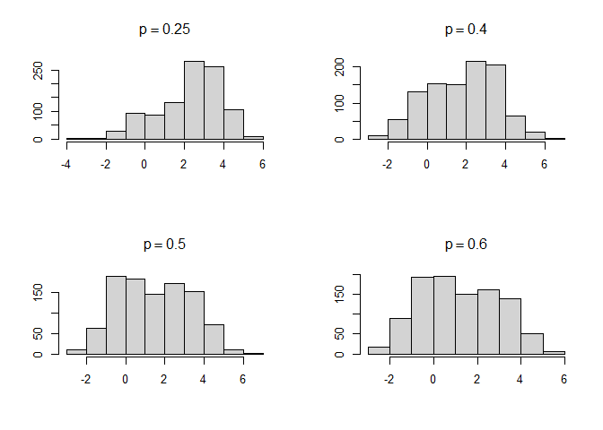
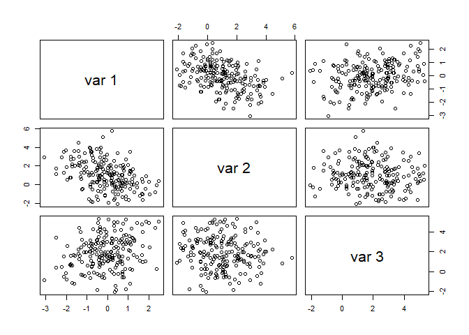

## Ex 3.2

### Problem
The standard Laplace distribution has density $f (x) = \frac{1}{2}e^{−|x|} , x ∈ R$. Use the inverse transform method to generate a random sample of size $1000$ from this distribution. Use one of the methods shown in this chapter to compare the generated sample to the target distribution.

### Solution

A random sample of size 1000 is generated from the inverse transform method. Here, the histogram ans laplace density function curve are shown to copare the result. 


```r
# inverse transform to generate random sample
laplace_quantile <- function (size) {
  u <- runif(size)
  sapply(u, function (v) if (v > 0.5) { -log(-2*v + 2) } else { log(2*v) })
}

# laplace density function
laplace_density <- function (v) {
  1/2*exp(-abs(v))
}

# variable initialize
size <- 1000
range <- c(-10,10)
x_seq <- seq(range[1], range[2], length.out = size)

# generating output and density
x_density <- laplace_density(x_seq)
y_random <- laplace_quantile(size)

# histogram ans density graph to compare the result
hist(y_random, probability = TRUE, breaks = 100, xlim = range)
lines(x_seq, y = x_density)
```

<!-- -->

## Ex 3.4

### Problem

The Rayleigh density $[162, Ch. 18]$ is

$$
f (x) = \frac{x}{σ^2}e^{−x^2/(2σ^2)} , x ≥ 0, σ > 0.
$$
Develop an algorithm to generate random samples from a $Rayleigh(σ)$ distribution. Generate $Rayleigh(σ)$ samples for several choices of $σ > 0$ and check that the mode of the generated samples is close to the theoretical mode $σ$ (check the histogram).

### Solution
Generate random samples from Rayleigh distribution. The quanltie function for Rayleigh is, $F(x, σ) =  σ \sqrt{-2*ln(1-x)}$. 

Used $ggplot2$ and $gridExtra$ to draw histogram for several choices of $σ > 0$. Estimate the mode for each and they look good with comparison to histogram.


```r
# Inverse transform method to generate random sample
rayleigh_random <- function (size, sigma) {
  u <- runif(size)
  sqrt(-2 * sigma ^ 2 * log(1 - u))
}

size <- 1000

# generate a collection of Sigma
sigmas <- 1:5


# generating the sample
xs <- sapply(sigmas, function (v) rayleigh_random(size, v))
# convert to matrix
mat <- matrix(xs, ncol = length(sigmas), dimnames = list(NULL, sigmas))
# convert to data frame
df <- data.frame(mat)

# diagram the histogram
p1 = qplot(df$X1, main = paste0("Sigma = ", sigmas[1]), binwidth=0.1, geom="histogram")
p2 = qplot(df$X2, main = paste0("Sigma = ", sigmas[2]), binwidth=0.1, geom="histogram")
p3 = qplot(df$X3, main = paste0("Sigma = ", sigmas[3]), binwidth=0.1, geom="histogram")
p4 = qplot(df$X4, main = paste0("Sigma = ", sigmas[4]), binwidth=0.1, geom="histogram")
p5 = qplot(df$X5, main = paste0("Sigma = ", sigmas[5]), binwidth=0.1, geom="histogram")
grid.arrange(p1, p2, p3, p4, p5)
```

<!-- -->

```r
# Estimate the mode
mode <- function(x) {
  ux <- unique(x)
  ux[which.max(tabulate(match(x, ux)))]
}
sapply(df, mode)
```

```
##        X1        X2        X3        X4        X5 
## 0.4807475 0.9488279 4.1856703 0.9161810 4.8222020
```

## Ex 3.9

### Problem

The rescaled Epanechnikov kernel [92] is a symmetric density function
$$f_e (x) = \frac{3}{4}(1 − x 2 ), |x| ≤ 1. $$
Devroye and Györfi [74, p. 236] give the following algorithm for simulation from this distribution. Generate iid $U_1 , U_2 , U_3 ∼ Uniform(−1, 1)$. If $|U_3| ≥ |U_2|$ and $|U_3| ≥ |U_1|$, deliver $U_2$ ; otherwise deliver $U_3$ . Write a function to generate random variates from $f_e$ , and construct the histogram density estimate of a large simulated random sample.

### Solution

Generated sample and density from Epanechnikov. Constructed histogram for the simulated sample.


```r
# generating iid
iid_gen <- function (size) {
  u1 <- runif(size, min = -1, max = 1)
  u2 <- runif(size, min = -1, max = 1)
  u3 <- runif(size, min = -1, max = 1)
  sapply(1:size, function(v)
    if (abs(u3[v]) >= abs(u2[v]) && abs(u3[v]) >= abs(u1[v])) u2[v] else u3[v]
  )
}

# generate the sample
size <- 1000
random_sample <- iid_gen(size = size)

# histogram of the random sample
hist(random_sample, probability = TRUE, breaks=20)
```

<!-- -->

## Ex 3.10

### Problem
Prove that the algorithm given in Exercise 3.9 generates variates from the density $f_e$ (3.9).

### Solution

Drawing the density curve using the given density function. The density curve over the histogram proves that the generated vairates consistent with density.


```r
# density function of Ex 3.9
epanechnikov_density <- function (x) {
  3/4 * (1 - x^2)
}

xlim <- range(random_sample)
x_seq <- seq(from = xlim[1], to = xlim[2], by = 0.01)
# histogram of Ex 3.9
hist(random_sample, probability = TRUE, breaks=20)
# Density from the funciton fe
lines(x = x_seq, y = epanechnikov_density(x_seq))
```

<!-- -->

## Ex 3.11

### Problem

Generate a random sample of size 1000 from a normal location mixture. The components of the mixture have $N (0, 1)$ and $N (3, 1)$ distributions with mixing probabilities $p_1$ and $p_2 = 1 − p_1$ . Graph the histogram of the sample with density superimposed, for $p_1 = 0.75$. Repeat with different values for $p_1$ and observe whether the empirical distribution of the mixture appears to be bimodal. Make a conjecture about the values of $p_1$ that produce bimodal mixtures.

### Solution

After constructing histogram for different values of $P_1$, it seems that bimodality appears in range $0.4 < p_1 < 0.6$


```r
# generate the normal location mixture
mixture <- function(n, p) {
  x1 <- rnorm(n, 0, 1)
  x2 <- rnorm(n, 3, 1)
  r <- sample(c(0, 1), n, replace = TRUE, prob = c(1 - p, p))
  r * x1 + (1 - r) * x2
}

# set the size
size <- 1000
# for p1 = 0.75
m_1 <- mixture(size, 0.75)
hist(m_1, main = expression(p == 0.75), xlab='', ylab='')
```

<!-- -->

```r
par(mfrow=c(2,2)) #creates 2x2 'matrix' of plots

# construct histogram for different p1
m_2 <- mixture(size, 0.25)
hist(m_2, main = expression(p == 0.25), xlab='', ylab='')

m_2 <- mixture(size, 0.4)
hist(m_2, main = expression(p == 0.4), xlab='', ylab='')

m_3 <- mixture(size, 0.5)
hist(m_3, main = expression(p == 0.5), xlab='', ylab='')

m_3 <- mixture(size, 0.6)
hist(m_3, main = expression(p == 0.6), xlab='', ylab='')
```

<!-- -->

## Ex 3.14

### Problem

Generate 200 random observations from the 3-dimensional multivariate normal distribution having mean vector $μ = (0, 1, 2)$ and covariance matrix

$$Σ = \begin{bmatrix}
1.0 & - 0.5 & 0.5\\
-0.5 & 1.0 & 0.5\\
0.5 & - 0.5 & 1.0\\
\end{bmatrix}$$

using the Choleski factorization method. Use the R pairs plot to graph an array of scatter plots for each pair of variables. For each pair of variables, (visually) check that the location and correlation approximately agree with the theoretical parameters of the corresponding bivariate normal distribution.

### Solution

A program to generate multivariate normal via Choleski factorization. Plotting the scatter plots and noticed that the sample patterns agree with correlations.


```r
runCholeski <- function(size, mus, sigma) {
  d <- length(mus)
  q <- t(chol(sigma))
  z <- matrix(rnorm(n = d * size), ncol = size, nrow = d) 
  t(q %*% z + mus)
}
mus <-  0:2
size <- 200
sigma <- matrix(c(1, -0.5, 0.5, -0.5, 2, -0.5, 0.5, -0.5, 3), ncol = 3)

ys <- runCholeski(size = size, mus = mus, sigma = sigma)

pairs(ys)
```

<!-- -->


## Ex 3.16

### Problem

Efron and Tibshirani discuss the $scor (bootstrap)$ test score data on
88 students who took examinations in five subjects [91, Table 7.1], [194, Table 1.2.1]. Each row of the data frame is a set of scores $(x_i1 , . . . , x_i5 )$ for the $i^{th}$ student. Standardize the scores by type of exam. That is, standardize the bivariate samples $(X_1 , X_2 )$ (closed book) and the trivariate samples $(X_3 , X_4 , X_5 )$ (open book). Compute the covariance matrix of the transformed sample of test scores.

### Solution
Computed the covariance matrix of the transformed sample of test scores.


```r
# normalization 
normalize <- function (data) {
  Sigma <- cov(data)
  mus <- sapply(1:ncol(data), function (v) mean(data[,v]))
  A <- chol(solve(Sigma))
  t(A %*% (t(data)-mus))
}
# bootstrap scor
norm.scor <- scor
m1 <- normalize(data.matrix(norm.scor[,1:2]))
m2 <- normalize(data.matrix(norm.scor[,3:5]))
norm.scor[,1:2] = m1
norm.scor[,3:5] = m2

# covariance matrix
round(cov(norm.scor), digits=4)
```

```
##        mec    vec    alg    ana    sta
## mec 1.0000 0.0000 0.1621 0.0776 0.1772
## vec 0.0000 1.0000 0.3323 0.2770 0.4364
## alg 0.1621 0.3323 1.0000 0.0000 0.0000
## ana 0.0776 0.2770 0.0000 1.0000 0.0000
## sta 0.1772 0.4364 0.0000 0.0000 1.0000
```

## Ex 4.2

### Problem

A compound Poisson process is a stochastic process ${X(t), t ≥ 0}$ that can be represented as the random sum $X(t) = \sum_{i=1}^{N(t)}{Y_i},  t ≥ 0,$ where ${N (t), t ≥ 0}$ is a Poisson process and $Y_1 , Y_2 , . . .$ are iid and independent of ${N (t), t ≥ 0}$. Write a program to simulate a compound Poisson(λ)–Gamma process (Y has a Gamma distribution). Estimate the mean and the variance of $X(10)$ for several choices of the parameters and compare with the theoretical values. Hint: Show that $E[X(t)] = λtE[Y_1 ]$ and $Var(X(t)) = λtE[Y_1^2 ]$.

### Soultion

The estimated mean and variance are almost similar with theoretical values.


```r
lambda = 2
shape = 5
scale = 2
size = 10000
t = 10

# generate N(t) which follow the poisson process.
ns = rpois(size, t * lambda)

# generate X(t) as in the problem description.
xs = sapply(ns, function (n) {
  ys = c(rgamma(n = n, shape = shape, scale = scale))
  sum(ys[1:n])
})
# Mean from function
(mean.s = mean(xs))
```

```
## [1] 199.7574
```

```r
# mean theoretical
(mean.t = lambda * t * shape * scale)
```

```
## [1] 200
```

```r
# Variance 
(var.s = var(xs))
```

```
## [1] 2377.782
```

```r
# From theoretical
(var.t = lambda * t * (shape * scale)^2)
```

```
## [1] 2000
```
